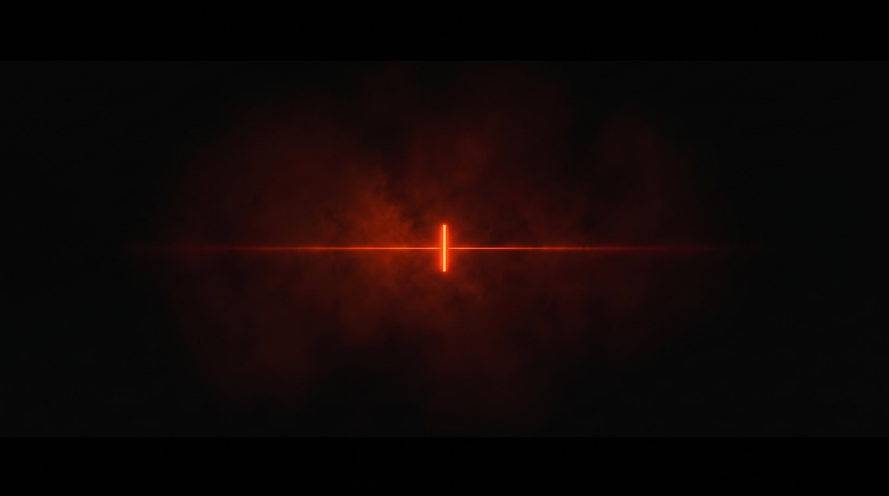
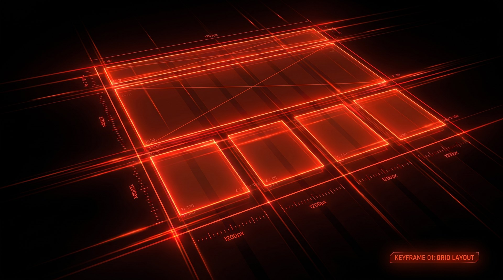
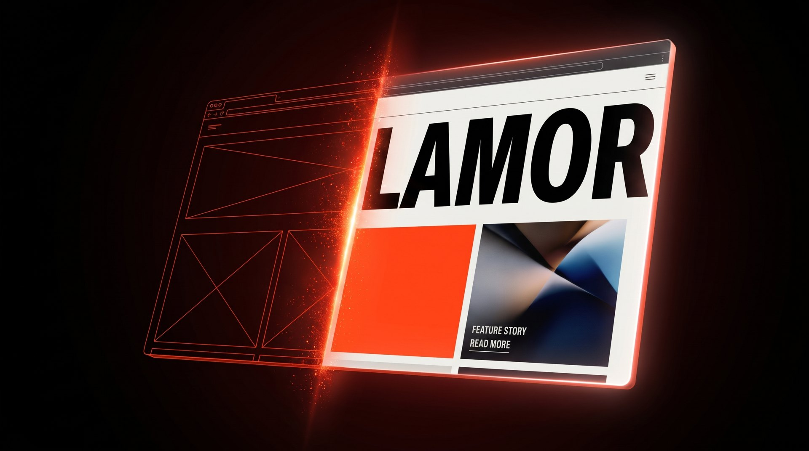
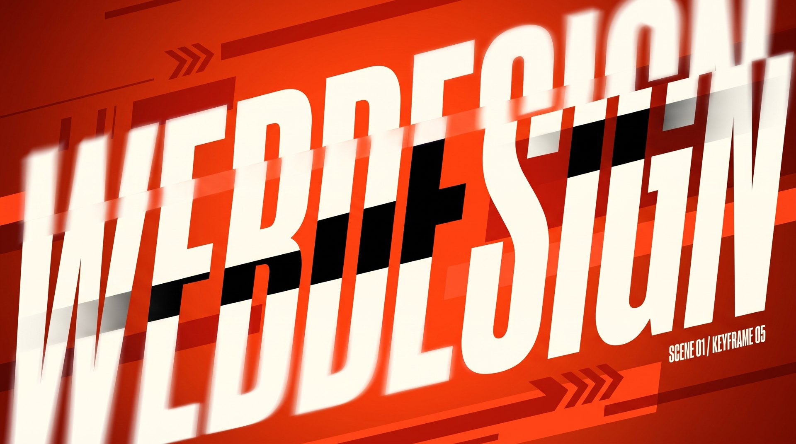
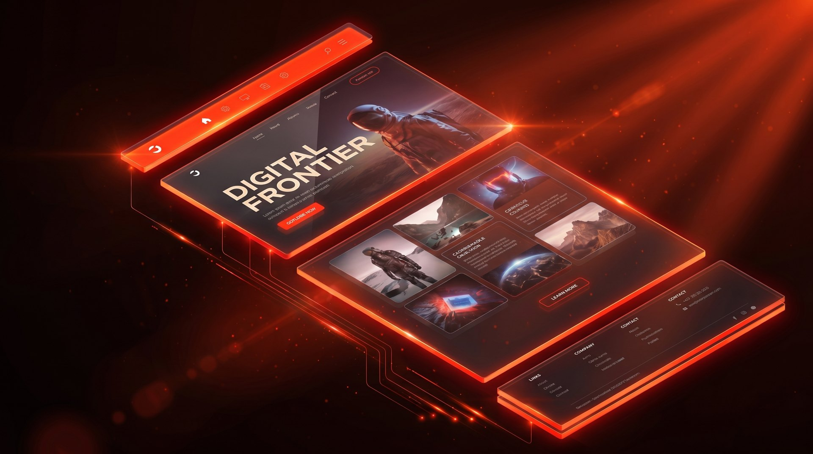
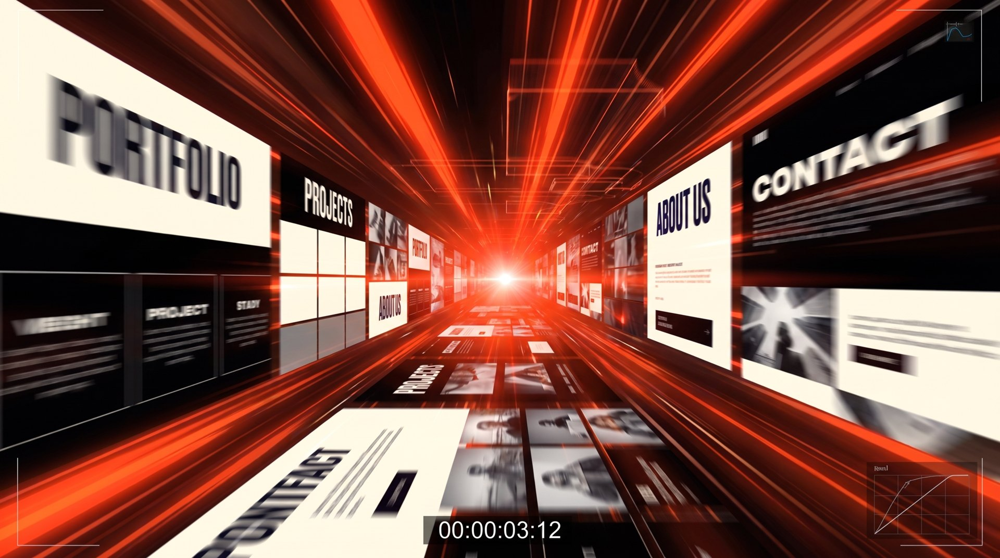
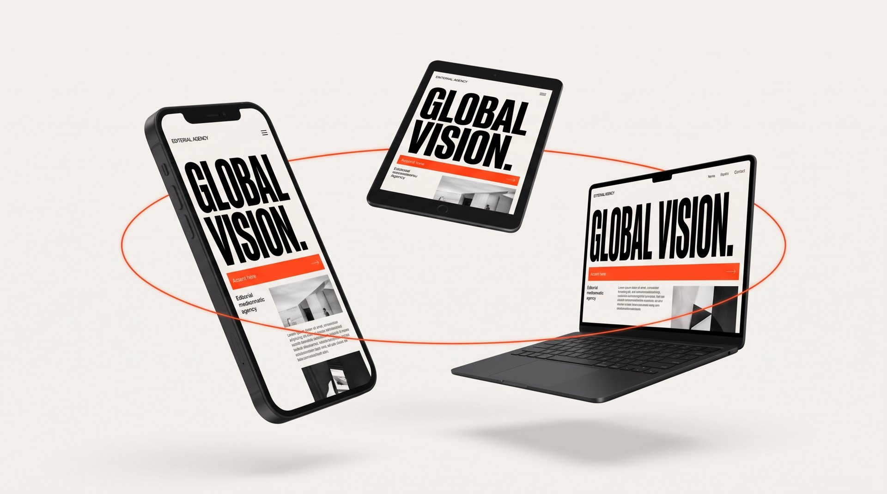
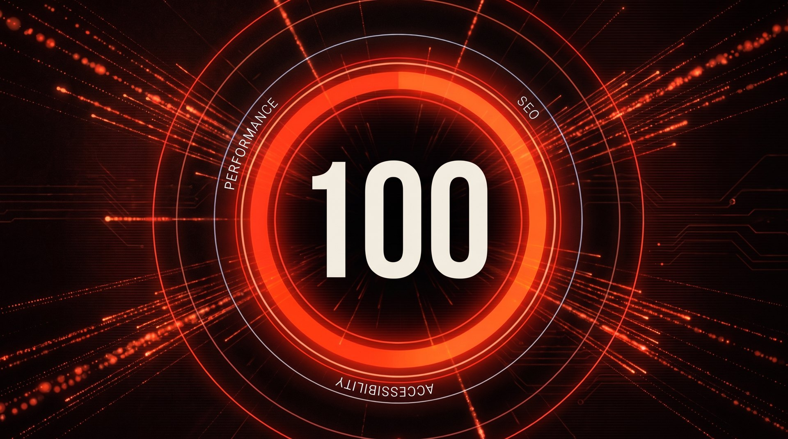
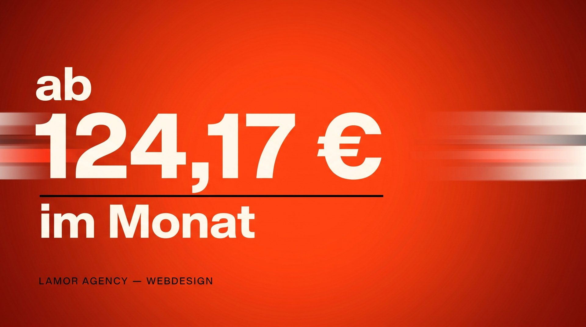
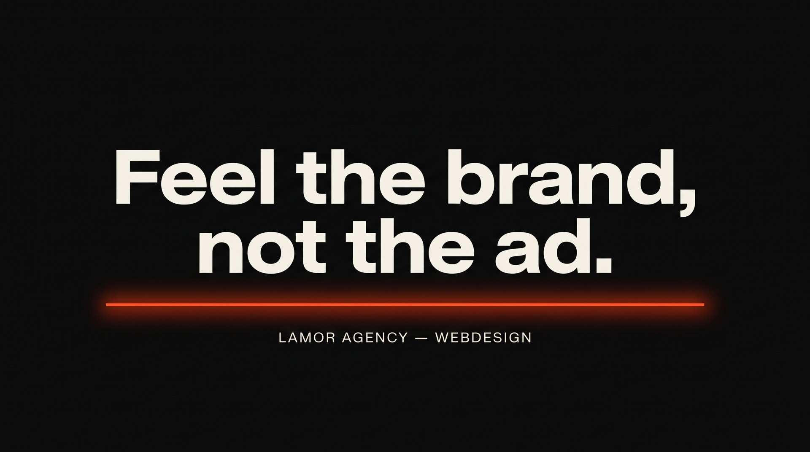

# LAMOR AGENCY – Webdesign · Hyper Motion Storyboard

**Format:** 30 s · 11 Shots · 16:9 (1920×1080, 25 fps) · Cutdown 9:16 für Reels/TikTok
**Musik:** Dark Electronic / Hybrid Trailer, **120 BPM** → 1 Beat = 0,5 s, 1 Takt = 2 s. Alle Cuts liegen auf dem Beat.
**Look:** Ink `#0a0a0a`, Paper `#f3f2ee`, Akzent **Rot-Orange `#ff4a1c`** (+ Deep Red `#d42a0a` für Verläufe/Schatten). Für dieses Video bewusst Rot-Orange statt dem Blau der Website – kein Blau im Bild. Typo: Archivo Variable, Headlines mit Breite 118 % (`--wd-mega`), Tracking −0.045em.
**Claim:** *Feel the brand, not the ad.*
**Keyframes:** generiert mit Higgsfield (Nano Banana, 2K, 16:9), Projekt „LAMOR – Webdesign Hyper Motion Storyboard“.

## Dramaturgie

| Akt | Zeit | Beats | Idee |
|---|---|---|---|
| I · Signal | 0:00–0:05 | 1–10 | Aus dem Nichts: ein Cursor, eine Linie, ein Raster. Webdesign beginnt mit Struktur. |
| II · Build | 0:05–0:15 | 11–30 | Wireframe wird Design, Typo explodiert, die Website zerlegt sich in ihre Ebenen. |
| III · Experience | 0:15–0:24 | 31–48 | Klick, Scroll, jedes Device, Performance. Die Seite fühlt sich an, statt nur auszusehen. |
| IV · Payoff | 0:24–0:30 | 49–60 | Der Preis knallt rein, dann Stille und der Claim. |

---

## Shots

### 01 · Signal — 0:00–0:02 (2,0 s)

- **Bild:** Schwarzes Void, ein rot-oranger Text-Cursor blinkt im Zentrum.
- **Motion:** 2× Blink auf Beat 1 + 3, auf Beat 4 schießt eine Laserlinie nach links und rechts bis an den Bildrand (Ease: expo-out, 8 Frames).
- **Kamera:** Statisch, minimaler Push-in 100 → 104 %.
- **Sound:** Sub-Hum, zwei digitale Ticks, Whoosh auf der Linie.
- **Übergang:** Die Linie wird zur ersten Rasterlinie von Shot 02 (Match Cut).
- **Video-Prompt:** *Tiny glowing red-orange cursor blinks twice in a black void, then fires a thin laser line that stretches to both frame edges at high speed, subtle haze, slow push-in, minimal premium motion design.*

### 02 · Grid — 0:02–0:05 (3,0 s)

- **Bild:** 12-Spalten-Raster zeichnet sich in Perspektive, Wireframe-Boxen für Header, Hero, Cards.
- **Motion:** Linien schreiben sich stroke-by-stroke (Stagger 2 Frames pro Linie), Maßketten und Koordinaten-Labels ploppen auf jedem 1/8-Beat.
- **Kamera:** Schneller Dolly-back + 15° Tilt, das Raster kippt in die Tiefe.
- **Sound:** Rhythmische Plotter-/Scribble-SFX im 16tel, Riser startet.
- **Übergang:** Whip-Pan nach rechts auf Beat 10.
- **Video-Prompt:** *Glowing red-orange vector lines rapidly draw a 12-column website wireframe grid in perspective on black, measurement ticks and labels popping in, camera dollies back and tilts, speed trails, technical and precise.*

### 03 · Wireframe → Design — 0:05–0:08 (3,0 s)

- **Bild:** Schwebendes Browserfenster; links noch Wireframe, rechts fertige LAMOR-Seite (Paper, riesiges „LAMOR“, rot-oranger Akzentblock).
- **Motion:** Eine glühende Naht wandert von links nach rechts und „rendert“ das Design, Partikel lösen sich an der Kante.
- **Kamera:** Orbit 20° um das Fenster, leichter Parallax.
- **Sound:** Glitchy Render-Sweep, Riser steigt weiter.
- **Übergang:** Das „LAMOR“ wird formatfüllend angezoomt → Typo-Smash.
- **Video-Prompt:** *A floating tilted browser window; a glowing red-orange seam sweeps across it, transforming red-orange wireframe lines into a finished editorial website with a huge wide black headline on off-white, particles at the seam, slow orbit camera.*

### 04 · Typo Smash — 0:08–0:10 (2,0 s)

- **Bild:** „WEBDESIGN“ in Archivo 118 % Breite, auf Rot-Orange, in Streifen geschnitten.
- **Motion:** Drop auf Beat 17: Wort rast diagonal durchs Bild, Streifen versetzen sich (Slice-Offset), ein Streifen invertiert schwarz. Hard Stop + 2 Frames Hold, dann Weiterfahrt.
- **Kamera:** 2D, Camera-Shake 3 Frames auf dem Drop.
- **Sound:** Bass-Drop, Impact, Tape-Stop.
- **Übergang:** Flash-Frame Paper-Weiß (1 Frame).
- **Video-Prompt:** *Giant ultra-wide bold word WEBDESIGN slices diagonally across a hot red-orange frame at high speed, letters split into horizontal strips that offset and snap back, one strip inverted black, heavy motion blur, kinetic typography.*

### 05 · Exploded Layers — 0:10–0:14 (4,0 s)

- **Bild:** Axonometrische Explosionsansicht: Nav, Hero, Cards, Buttons, Footer als Glasebenen.
- **Motion:** Ebenen fahren aus einer flachen Seite auseinander (Stagger 3 Frames), rot-orange Verbindungslinien pulsieren auf jedem Beat.
- **Kamera:** Langsamer Crane-Up + Orbit 30°, Tiefenschärfe wandert von Nav bis Footer.
- **Sound:** Glassy Layer-Clicks, Pad öffnet sich.
- **Übergang:** Die Hero-Ebene fliegt in die Kamera → Shot 06.
- **Video-Prompt:** *Exploded axonometric view of a website, translucent glass layers (navigation, hero, card grid, footer) separating in depth with glowing red-orange edges, camera cranes up and orbits, rack focus through the layers, volumetric light.*

### 06 · The Click — 0:14–0:16 (2,0 s)

- **Bild:** Makro: 3D-Pointer klickt Button „START PROJECT“, rot-orange Schockwelle.
- **Motion:** Speed-Ramp: Pointer rast heran (100 %) → Klick in Zeitlupe (20 %) → Schockwelle zurück auf 100 %.
- **Kamera:** Extreme Macro, Rack Focus vom Pointer auf den Button.
- **Sound:** Satter Mechanik-Klick, Sub-Boom, kurzer Vakuum-Moment.
- **Übergang:** Die Schockwelle füllt das Bild → Zoom-Through in den Tunnel.
- **Video-Prompt:** *Extreme macro of a glossy white 3D mouse pointer clicking a red-orange pill button labeled START PROJECT, speed ramp into slow motion on the click, circular red-orange shockwave and particles burst outward, rack focus, black background.*

### 07 · Infinite Scroll — 0:16–0:19 (3,0 s)

- **Bild:** Tunnel aus Website-Sektionen (Portfolio, Typo-Blöcke, Grids) mit rot-orangem Fluchtpunkt.
- **Motion:** Hyperspeed nach vorne, Radial-Blur, Sektionen rotieren leicht um die Achse.
- **Kamera:** FPV-Flug, leichter Barrel-Roll 10°.
- **Sound:** Doppler-Whooshes im 8tel, Arp-Line.
- **Übergang:** Weißer Fluchtpunkt blendet auf → Paper-Studio von Shot 08.
- **Video-Prompt:** *First-person hyper-speed flight through a tunnel made of website sections, portfolio images and bold typography streaking past with radial motion blur toward a bright red-orange vanishing point, slight barrel roll.*

### 08 · Every Screen — 0:19–0:22 (3,0 s)

- **Bild:** Phone, Tablet, Laptop im Orbit, alle zeigen dieselbe LAMOR-Seite.
- **Motion:** Devices drehen sich im Orbit, das Layout reflowt live von Desktop auf Mobile.
- **Kamera:** Ruhiger 360°-Orbit (Kontrast zum Tempo davor), weiche Schatten.
- **Sound:** Musik dünnt aus, Piano-/Pluck-Motiv, Device-Chimes.
- **Übergang:** Hard Cut zurück auf Schwarz.
- **Video-Prompt:** *Matte black smartphone, tablet and laptop floating in slow orbit in a seamless off-white studio, all screens showing the same minimalist editorial website with a wide black headline, layouts reflowing responsively, soft shadows.*

### 09 · Performance — 0:22–0:24 (2,0 s)

- **Bild:** Rot-oranger Gauge-Ring, „100“ im Zentrum, Orbit-Labels PERFORMANCE · SEO · ACCESSIBILITY.
- **Motion:** Ring füllt sich in 1,0 s, Zahl zählt 0 → 100 (tabular nums), Datenpartikel fliegen ins Zentrum. Auf Beat 48 Flash.
- **Kamera:** Frontal, langsamer Push-in.
- **Sound:** Counter-Ticks, finaler Riser.
- **Übergang:** Ring kollabiert zu einer Linie, die auf Beat 49 aufreißt und die Fläche rot-orange flutet → Preis-Frame.
- **Video-Prompt:** *A glowing red-orange circular gauge ring fills up while a big number counts up to 100 in the center, thin orbiting rings with labels PERFORMANCE, SEO, ACCESSIBILITY, data particles streaming inward, black background, slow push-in.*

### 10 · Preis — 0:24–0:27 (3,0 s)

- **Bild:** Vollfläche Rot-Orange. Off-White, Archivo 118 %: klein „ab“, riesig „124,17 €“, darunter „im Monat“. Schwarze Linie unter dem Preis, unten links „LAMOR AGENCY — WEBDESIGN“.
- **Motion:** Beat 49: Fläche flutet, „124,17 €“ slammt in Streifen geschnitten rein (Slice-Offset wie Shot 04) und rastet auf Beat 50 ein. Ziffern rollen kurz als Slot-Counter durch (tabular nums) und stoppen exakt auf 124,17. „ab“ und „im Monat“ per Text-Mask auf Beat 51. Danach 1,5 s ruhiger Hold, damit der Preis gelesen wird.
- **Kamera:** 2D, Micro-Shake 2 Frames beim Einrasten, dann langsamer Push-in 100 → 103 %.
- **Sound:** Impact + Kassen-/Slot-Tick beim Einrasten, Musik fällt danach auf Pad zurück.
- **Übergang:** Die schwarze Linie unter dem Preis wandert zur Bildmitte, die Fläche wischt auf Schwarz → wird zur Linie im End Card.
- **Text final:** Preis zwingend im Schnittprogramm mit echter Archivo setzen, Schreibweise „ab 124,17 € im Monat“ (Keyframe ist nur Layout-Referenz). Ggf. Fußnote „zzgl. MwSt.“ bzw. Laufzeit klein unten rechts ergänzen, falls rechtlich nötig.
- **Video-Prompt:** *A solid hot red-orange frame floods the screen, a giant ultra-wide bold off-white price 124,17 € slams in as horizontal slice strips that snap into place, digits briefly roll like a slot counter, small words ab and im Monat mask-reveal, micro camera shake then slow push-in, Swiss poster motion design.*

### 11 · End Card — 0:27–0:30 (3,0 s)

- **Bild:** Schwarz. „Feel the brand, / not the ad.“ – darunter „LAMOR AGENCY — WEBDESIGN“, rot-orange Linie.
- **Motion:** Zeilen-Reveal per Text-Mask von unten (wie `<Words>` auf der Website), Stagger 4 Frames; die Linie zeichnet sich von links. Danach 1,5 s Hold.
- **Kamera:** Statisch.
- **Sound:** Ein einzelner tiefer Hit, Hall-Ausklang, Stille.
- **Text final:** Im Schnittprogramm mit echter Archivo setzen (die KI-Typo im Keyframe ist nur Layout-Referenz). URL `lamoragency.de` klein unten rechts.

---

## Produktion mit Higgsfield

1. **Image-to-Video pro Shot:** Keyframe als Startframe, Video-Prompt aus dem Shot oben. Empfehlung: Kling 3.0 (Motion, Kamera) für Shots 02, 05, 06, 07, 08; Seedance für 01, 03, 04, 09. Dauer je 5 s generieren, im Schnitt auf die Shotlänge kürzen.
2. **Typo nachbauen:** Shots 04 und 10 zusätzlich als echte Motion-Typo (After Effects / Higgsedit) mit Archivo, damit Schriftbild und Schreibweise exakt stimmen.
3. **Schnitt auf 120 BPM:** Marker alle 0,5 s, Cuts wie oben. Speed-Ramps in 06 und 04.
4. **Grade:** Schwarz nicht unter `#0a0a0a` crushen, Akzent auf `#ff4a1c` kalibrieren, keine Blautöne, feines Filmkorn über alles.
5. **9:16-Cutdown (15 s):** Shots 01 → 04 → 06 → 07 → 10 (Preis, voll 3 s) → 11, Typo zentriert, Safe Zones für UI oben/unten beachten.

## Keyframe-Quellen

| Shot | Higgsfield Job-ID |
|---|---|
| 01 | `2d4dc9d0-ade7-41d4-8a6a-85c9a230049e` |
| 02 | `e7daff4e-1728-46c6-95f2-1bbd16dbbedf` (ohne Label: `f1b10be6-3c56-4626-863d-d16942b349bd`) |
| 03 | `88c52880-c41a-4bcf-bcd8-ff1736246862` |
| 04 | `35caad5f-2704-4fa5-a035-6c236c73b81c` (ohne Label: `cae5b124-0ec3-4c67-8280-46349dfd645d`) |
| 05 | `0e5187c8-77c8-469a-9c05-c09ee94f7c69` |
| 06 | `cce735cd-245a-4214-bbf8-1c12a1b4a644` |
| 07 | `36d442bb-9a59-4436-b71d-6a2df037c8e7` (ohne Overlays: `b314c675-c177-4fe9-8eb0-761272c3d9ac`) |
| 08 | `2c0c471b-7712-4fec-b2c0-b94137e8c276` |
| 09 | `5fb6be50-3d97-433c-9588-fd074a5ec324` |
| 10 | `04ec3db7-789e-482d-b95a-f49a25f3980d` / `b91c4b1b-d9d0-4496-89ea-882a68b17b5e` (freigegebene Fassung als Upload `bab9545f-6710-4069-9068-eea2f52642e6`) |
| 11 | `548bea3e-88e3-4d35-b0f2-09affd60e2c6` |

## Fertiger Film (v1)

**Datei:** [lamor-webdesign-hypermotion-30s.mp4](https://d2ol7oe51mr4n9.cloudfront.net/user_37fYL4bggs7IW7dvFbpi4QuQCgR/193aee80-99d9-44fc-b20b-47770c971d47.mp4) · 30,16 s · 1920×1080 · 25 fps · H.264 · ohne Ton

**Aufbau:** Ein durchgehender Film ohne harte Schnitte. Kling 3.0 (Pro) hat 10 Übergänge mit festem Start- und End-Frame erzeugt (01→02 … 10→11), jeder endet exakt auf dem Frame, mit dem der nächste beginnt.

| Segment | Übergang | Länge im Schnitt |
|---|---|---|
| 1–4 | Signal → Grid → Wireframe → Typo Smash → Layers | je 2,5 s (auf 119 % beschleunigt) |
| 5 | Layers → Click | 3,4 s (119 %) |
| 6–8 | Click → Tunnel → Devices → Performance | je 2,5 s (119 %) |
| 9 | Performance → Preis | 3,0 s (Echtzeit) |
| Hold | **Preis „ab 124,17 € im Monat“**, Originalbild | 1,5 s |
| 10 | Preis → End Card | 3,0 s (Echtzeit) |
| Hold | End Card, Fade auf Schwarz | 1,6 s |

**Higgsfield Job-IDs der Übergänge:** `7251e06a` · `23eed841` · `3f5c1677` · `9c80f058` · `b72d651c` · `c23639e8` · `8689e5eb` · `712aa636` · `cd7ef1a4` · `908d41a5`
